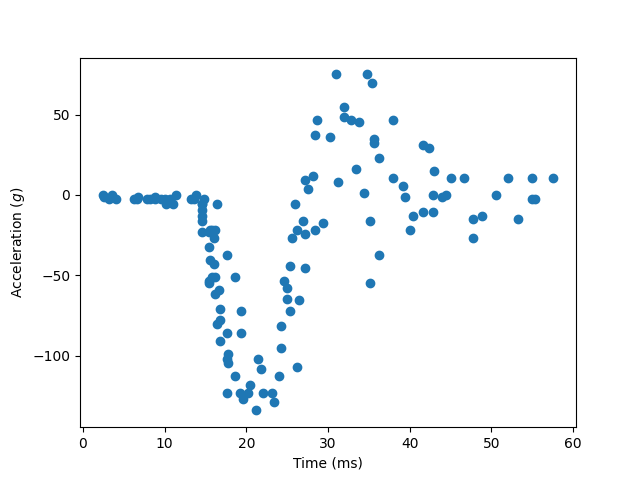
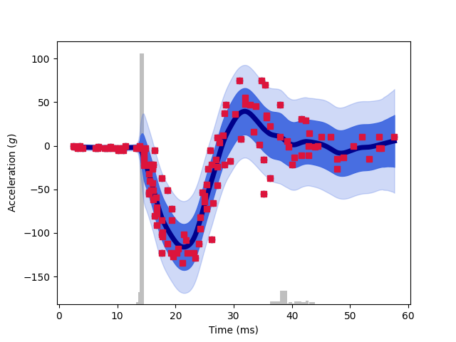
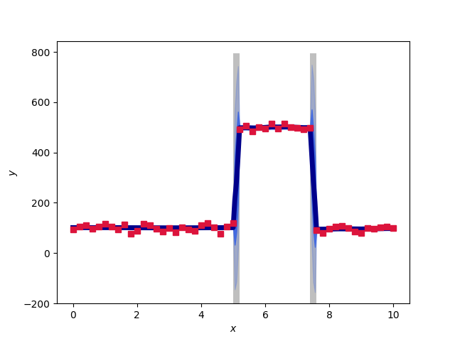

More examples
=============

Motorcyle data
^^^^^^^^^^^^^^

This is a classic dataset featuring unknown heteroscedastic noise.

   Motorcycle dataset.

The noise increases near 10 and 30. We model it with our TGP.

.. literalinclude:: ../../example/motorcycle.py
  :language: python
  
The result correctly models the heteroscedastic noise in the distinct regions.

   TGP model of motorcyle dataset. The grey bars show the locations of partitions.

  
Step-functions
^^^^^^^^^^^^^^

The data contains step-functions, which ordinary GPs struggle with.

.. literalinclude:: ../../example/step_functions.py
  :language: python
  
The step is modeled appropriately by the TGP:

   TGP model of step functions. The grey bars show the locations of partitions.
